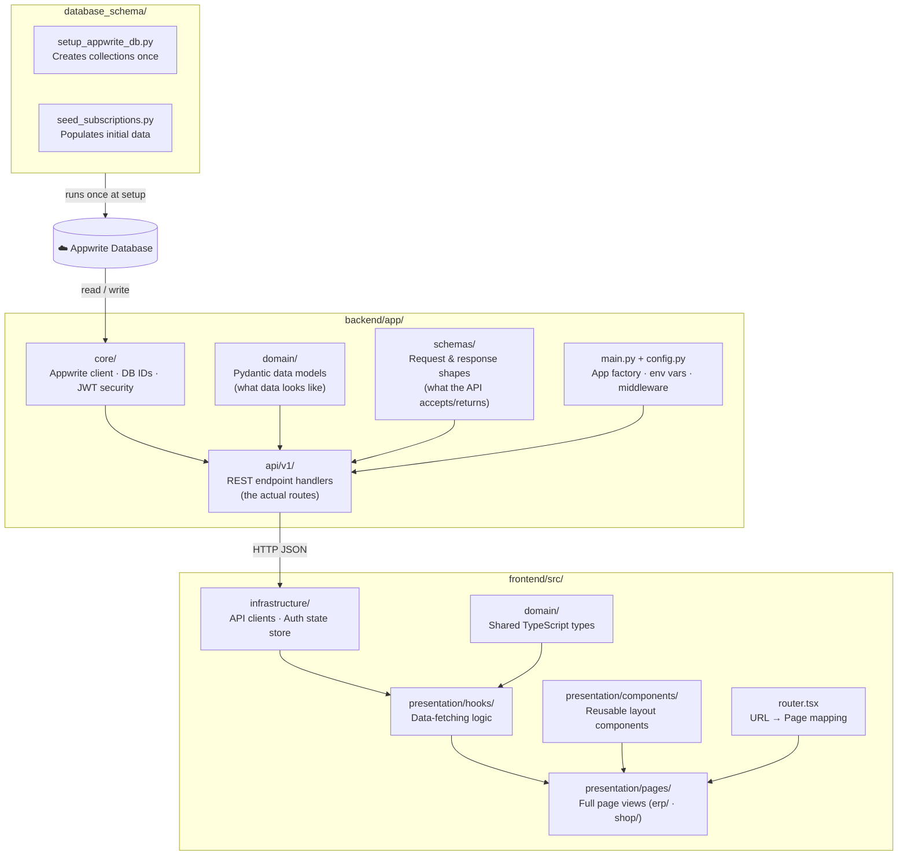

# Project File Structure – Mechanics on Wheels

> Excludes: `node_modules/`, `venv/`, `.git/`, `__pycache__/`, `.vscode/`

---

## 🌐 Group 1 — Live Website (Active Codebase)

The three folders that directly power the running application.

---

### 🏗️ Fixed Architecture Skeleton

These are the folders that **never change** no matter what new features or modules are added. Every new file created for the app slots into one of these existing directories.

#### How the Layers Connect



#### Fixed Folder Reference

| Layer | Fixed Folder | What goes here | Changes? |
|-------|-------------|----------------|----------|
| **DB Setup** | `database_schema/` | One-time scripts to create & seed the DB | ➕ New scripts added here for new collections |
| **Backend – Core** | `backend/app/core/` | Appwrite client, DB ID constants, JWT helpers | 🔒 Rarely changes — infrastructure only |
| **Backend – Models** | `backend/app/domain/` | Pydantic classes defining what each entity *is* | ➕ New model file per new entity |
| **Backend – Schemas** | `backend/app/schemas/` | Pydantic classes defining API request/response shapes | ➕ New schema file per new endpoint group |
| **Backend – API** | `backend/app/api/v1/` | FastAPI route handlers (the actual endpoints) | ➕ New `.py` file per new feature area |
| **Backend – Config** | `backend/app/config.py` | Env vars & app-wide settings | 🔒 Only grows when new env vars are added |
| **Frontend – Types** | `frontend/src/domain/` | TypeScript interfaces & types shared across the app | ➕ Grows as new data types are needed |
| **Frontend – Clients** | `frontend/src/infrastructure/api/` | Axios/fetch clients configured with auth tokens | 🔒 Only changes if auth strategy changes |
| **Frontend – Store** | `frontend/src/infrastructure/store/` | Zustand global state (auth tokens, session) | 🔒 Only grows if new global state is needed |
| **Frontend – Hooks** | `frontend/src/presentation/hooks/` | Hooks that call the API clients | ➕ New hook file per new data operation |
| **Frontend – Components** | `frontend/src/presentation/components/` | Shared layout wrappers (Navbar, Sidebar, etc.) | ➕ New file only for reusable UI primitives |
| **Frontend – Pages** | `frontend/src/presentation/pages/` | Full page views, organized under `erp/` and `shop/` | ➕ New page file per new screen |
| **Frontend – Router** | `frontend/src/router.tsx` | URL-to-page route definitions | ➕ One new line per new page added |

> 🔒 = Structural skeleton, stays stable &nbsp;&nbsp; ➕ = Fixed folder, but new files are added into it as the app grows

---

### 📂 Full File Tree

```
Mechanics-on-Wheels/
│
├── database_schema/                        # DB setup, seeding & SQL schemas
│   ├── setup_appwrite_db.py                # Creates Appwrite collections & attributes
│   ├── seed_subscriptions.py               # Seeds modules/subscriptions data
│   ├── global_databse.sql                  # Global DB SQL schema reference
│   └── erp_database.sql                    # ERP DB SQL schema reference
│
├── backend/                                # FastAPI backend
│   ├── main.py  →  app/main.py
│   ├── requirements.txt
│   ├── pyrightconfig.json
│   ├── .env / .env.example
│   │
│   └── app/
│       ├── main.py                         # FastAPI app factory & middleware
│       ├── config.py                       # Environment variable settings
│       │
│       ├── core/                           # Shared infrastructure
│       │   ├── appwrite_client.py          # Appwrite SDK client singleton
│       │   ├── database.py                 # DB/collection ID constants & helpers
│       │   ├── security.py                 # JWT creation & verification (mechanics)
│       │   └── shop_security.py            # JWT helpers (shop admins)
│       │
│       ├── api/
│       │   └── v1/                         # REST API endpoints (v1)
│       │       ├── router.py               # Registers all sub-routers
│       │       ├── auth.py                 # POST /auth/login  (mechanic login)
│       │       ├── shop_auth.py            # POST /shop-auth/login|register
│       │       ├── shops.py                # CRUD /shops  (shop & mechanic mgmt)
│       │       ├── job_cards.py            # CRUD /job-cards
│       │       ├── vehicles.py             # CRUD /vehicles
│       │       └── subscriptions.py        # CRUD /subscriptions
│       │
│       ├── domain/                         # Pydantic domain models (data shapes)
│       │   ├── mechanic.py
│       │   ├── shop.py
│       │   ├── job_card.py
│       │   ├── vehicle.py
│       │   ├── vehicle_owner.py
│       │   ├── subscription.py
│       │   └── active_sub.py
│       │
│       └── schemas/                        # Request/response Pydantic schemas
│           ├── auth.py
│           ├── mechanic.py
│           ├── shop.py
│           ├── job_card.py
│           └── vehicle.py
│
└── frontend/                               # React + TypeScript frontend (Vite)
    ├── index.html
    ├── package.json
    ├── tsconfig.json / tsconfig.node.json
    ├── vite.config.ts                      # Dev-server proxy → backend
    ├── .env.example
    │
    └── src/
        ├── main.tsx                        # React app entry point
        ├── App.tsx                         # Root component
        ├── router.tsx                      # React Router route definitions
        ├── index.css                       # Global styles
        │
        ├── domain/
        │   └── types.ts                    # Shared TypeScript types
        │
        ├── infrastructure/                 # External-facing adapters
        │   ├── api/
        │   │   ├── client.ts               # Base API client (mechanic/ERP auth)
        │   │   └── shopClient.ts           # API client (shop admin auth)
        │   └── store/
        │       └── authStore.ts            # Zustand auth state store
        │
        └── presentation/                   # UI layer
            ├── components/
            │   ├── AppLayout.tsx
            │   ├── ShopLayout.tsx
            │   ├── Navbar.tsx
            │   └── Sidebar.tsx
            │
            ├── hooks/
            │   ├── useAuth.ts              # Mechanic/ERP auth hook
            │   ├── useShopAuth.ts          # Shop admin auth hook
            │   ├── useModules.ts           # Module/subscription data hook
            │   └── usePWAInstall.ts        # PWA install prompt hook
            │
            └── pages/
                ├── LandingPage.tsx         # Public landing page  (route: /)
                │
                ├── erp/                    # Mechanic-facing pages
                │   ├── LoginPage.tsx
                │   ├── DashboardPage.tsx
                │   ├── JobCardsPage.tsx
                │   ├── VehiclesPage.tsx
                │   ├── ModulesPage.tsx
                │   └── PWADownloadPage.tsx
                │
                └── shop/                   # Shop-admin-facing pages
                    ├── ShopLoginPage.tsx
                    ├── ShopRegisterPage.tsx
                    ├── ShopSettingsPage.tsx
                    ├── ShopMarketplacePage.tsx
                    ├── ShopSubscriptionPage.tsx
                    └── MechanicModulesPage.tsx
```

---

## 📄 Group 2 — Documentation & Reference (Theoretical)

Files that describe, plan, or document the project — not executed at runtime.

```
Mechanics-on-Wheels/
│
├── README.md                               # Top-level project overview
│
├── backend/
│   ├── DATABASE_SETUP.md                   # How to set up the Appwrite database
│   └── IDE_SETUP.md                        # IDE configuration guide
│
├── WebApp_Destop App/                      # Design docs & visual assets
│   ├── Readme.MD
│   ├── Communication_Files.md              # Map of communicator files
│   ├── File_Structure.md                   # This file
│   └── first_look/
│       └── Website/                        # Early UI screenshots / mockups
│
└── test_create_mechanic.py                 # Ad-hoc API test scripts
    test_list_databases.py
    test_patch_schema.py
```

---

## 🧪 Group 3 — Prototype (Early Exploration)

The original Python prototype built before the current web architecture was chosen.

```
Mechanics-on-Wheels/
│
└── Python wireframe/
    ├── wireframe.py                        # Initial UI / flow prototype
    ├── dbconnect.py                        # Early DB connection experiment
    ├── identifier.py                       # Utility script
    └── testFile.csv                        # Sample data used during prototyping
```

---

## 🗂️ Detailed File Master List

| Category | File Path | File Name | Description |
|----------|-----------|-----------|-------------|
| Backend | `backend/.env.example` | `.env.example` | Environment variables template / configuration |
| Backend | `backend/.env` | `.env` | Environment variables template / configuration |
| Backend | `backend/DATABASE_SETUP.md` | `DATABASE_SETUP.md` | Setup instructions for Appwrite database |
| Backend | `backend/IDE_SETUP.md` | `IDE_SETUP.md` | Developer Environment/IDE setup instructions |
| Backend | `backend/app/__init__.py` | `__init__.py` | Python module indicator |
| Backend | `backend/app/api/__init__.py` | `__init__.py` | Python module indicator |
| Backend | `backend/app/api/v1/__init__.py` | `__init__.py` | Python module indicator |
| Backend | `backend/app/api/v1/auth.py` | `auth.py` | FastAPI endpoint handlers for auth |
| Backend | `backend/app/api/v1/global_db.py` | `global_db.py` | FastAPI endpoint handlers for global_db |
| Backend | `backend/app/api/v1/job_cards.py` | `job_cards.py` | FastAPI endpoint handlers for job_cards |
| Backend | `backend/app/api/v1/router.py` | `router.py` | API router aggregator for v1 |
| Backend | `backend/app/api/v1/shop_auth.py` | `shop_auth.py` | FastAPI endpoint handlers for shop_auth |
| Backend | `backend/app/api/v1/shops.py` | `shops.py` | FastAPI endpoint handlers for shops |
| Backend | `backend/app/api/v1/subscriptions.py` | `subscriptions.py` | FastAPI endpoint handlers for subscriptions |
| Backend | `backend/app/api/v1/vehicles.py` | `vehicles.py` | FastAPI endpoint handlers for vehicles |
| Backend | `backend/app/config.py` | `config.py` | Environment variables loader (Pydantic BaseSettings) |
| Backend | `backend/app/core/__init__.py` | `__init__.py` | Python module indicator |
| Backend | `backend/app/core/appwrite_client.py` | `appwrite_client.py` | Appwrite client setup and API connection |
| Backend | `backend/app/core/database.py` | `database.py` | Database and collection ID constants |
| Backend | `backend/app/core/security.py` | `security.py` | JWT creation and validation logic |
| Backend | `backend/app/core/shop_security.py` | `shop_security.py` | JWT creation and validation logic |
| Backend | `backend/app/domain/__init__.py` | `__init__.py` | Python module indicator |
| Backend | `backend/app/domain/active_sub.py` | `active_sub.py` | Pydantic domain object model for active_sub |
| Backend | `backend/app/domain/job_card.py` | `job_card.py` | Pydantic domain object model for job_card |
| Backend | `backend/app/domain/mechanic.py` | `mechanic.py` | Pydantic domain object model for mechanic |
| Backend | `backend/app/domain/shop.py` | `shop.py` | Pydantic domain object model for shop |
| Backend | `backend/app/domain/subscription.py` | `subscription.py` | Pydantic domain object model for subscription |
| Backend | `backend/app/domain/vehicle.py` | `vehicle.py` | Pydantic domain object model for vehicle |
| Backend | `backend/app/domain/vehicle_owner.py` | `vehicle_owner.py` | Pydantic domain object model for vehicle_owner |
| Backend | `backend/app/main.py` | `main.py` | FastAPI application factory and middleware |
| Backend | `backend/app/schemas/__init__.py` | `__init__.py` | Python module indicator |
| Backend | `backend/app/schemas/auth.py` | `auth.py` | Pydantic schema definitions for auth endpoints |
| Backend | `backend/app/schemas/job_card.py` | `job_card.py` | Pydantic schema definitions for job_card endpoints |
| Backend | `backend/app/schemas/mechanic.py` | `mechanic.py` | Pydantic schema definitions for mechanic endpoints |
| Backend | `backend/app/schemas/shop.py` | `shop.py` | Pydantic schema definitions for shop endpoints |
| Backend | `backend/app/schemas/vehicle.py` | `vehicle.py` | Pydantic schema definitions for vehicle endpoints |
| Backend | `backend/pyrightconfig.json` | `pyrightconfig.json` | Python strict type-checking configuration |
| Backend | `backend/requirements.txt` | `requirements.txt` | Python PyPI dependencies |
| Database | `database_schema/.env` | `.env` | Environment variables template / configuration |
| Database | `database_schema/erp_database.sql` | `erp_database.sql` | SQL schema design reference |
| Database | `database_schema/global_databse.sql` | `global_databse.sql` | SQL schema design reference |
| Database | `database_schema/migrations.py` | `migrations.py` | Database schema migration and tracking script |
| Database | `database_schema/setup_appwrite_db.py` | `setup_appwrite_db.py` | Appwrite database/collection initialization script |
| Database | `database_schema/unified_database_uml.png` | `unified_database_uml.png` | Visual UML diagram reference |
| Frontend | `frontend/.env.example` | `.env.example` | Environment variables template / configuration |
| Frontend | `frontend/index.html` | `index.html` | Base HTML application shell template |
| Frontend | `frontend/package-lock.json` | `package-lock.json` | NPM dependencies and project scripts |
| Frontend | `frontend/package.json` | `package.json` | NPM dependencies and project scripts |
| Frontend | `frontend/src/App.tsx` | `App.tsx` | Root React Layout and Router host component |
| Frontend | `frontend/src/domain/types.ts` | `types.ts` | Global TypeScript architecture types and interfaces |
| Frontend | `frontend/src/index.css` | `index.css` | Tailwind layout and global base CSS styles |
| Frontend | `frontend/src/infrastructure/api/client.ts` | `client.ts` | Axios client interceptors and HTTP configuration |
| Frontend | `frontend/src/infrastructure/api/shopClient.ts` | `shopClient.ts` | Axios client interceptors and HTTP configuration |
| Frontend | `frontend/src/infrastructure/store/authStore.ts` | `authStore.ts` | Zustand global state store provider |
| Frontend | `frontend/src/main.tsx` | `main.tsx` | Vite React application bootstrap entrypoint |
| Frontend | `frontend/src/presentation/components/AppLayout.tsx` | `AppLayout.tsx` | Shared reusable React UI component |
| Frontend | `frontend/src/presentation/components/Navbar.tsx` | `Navbar.tsx` | Shared reusable React UI component |
| Frontend | `frontend/src/presentation/components/ShopLayout.tsx` | `ShopLayout.tsx` | Shared reusable React UI component |
| Frontend | `frontend/src/presentation/components/Sidebar.tsx` | `Sidebar.tsx` | Shared reusable React UI component |
| Frontend | `frontend/src/presentation/hooks/useAuth.ts` | `useAuth.ts` | React query/mutation hook for API data |
| Frontend | `frontend/src/presentation/hooks/useModules.ts` | `useModules.ts` | React query/mutation hook for API data |
| Frontend | `frontend/src/presentation/hooks/usePWAInstall.ts` | `usePWAInstall.ts` | React query/mutation hook for API data |
| Frontend | `frontend/src/presentation/hooks/useShopAuth.ts` | `useShopAuth.ts` | React query/mutation hook for API data |
| Frontend | `frontend/src/presentation/pages/LandingPage.tsx` | `LandingPage.tsx` | Public-facing website landing page |
| Frontend | `frontend/src/presentation/pages/erp/DashboardPage.tsx` | `DashboardPage.tsx` | Mechanic ERP authenticated view component |
| Frontend | `frontend/src/presentation/pages/erp/GlobalDbPage.tsx` | `GlobalDbPage.tsx` | Mechanic ERP authenticated view component |
| Frontend | `frontend/src/presentation/pages/erp/JobCardsPage.tsx` | `JobCardsPage.tsx` | Mechanic ERP authenticated view component |
| Frontend | `frontend/src/presentation/pages/erp/ModulesPage.tsx` | `ModulesPage.tsx` | Mechanic ERP authenticated view component |
| Frontend | `frontend/src/presentation/pages/erp/PWADownloadPage.tsx` | `PWADownloadPage.tsx` | Mechanic ERP authenticated view component |
| Frontend | `frontend/src/presentation/pages/erp/VehiclesPage.tsx` | `VehiclesPage.tsx` | Mechanic ERP authenticated view component |
| Frontend | `frontend/src/presentation/pages/logins/LoginPage.tsx` | `LoginPage.tsx` | Authentication screen UI component |
| Frontend | `frontend/src/presentation/pages/logins/ShopLoginPage.tsx` | `ShopLoginPage.tsx` | Authentication screen UI component |
| Frontend | `frontend/src/presentation/pages/logins/ShopRegisterPage.tsx` | `ShopRegisterPage.tsx` | Authentication screen UI component |
| Frontend | `frontend/src/presentation/pages/shop/MechanicModulesPage.tsx` | `MechanicModulesPage.tsx` | Shop portal authenticated view component |
| Frontend | `frontend/src/presentation/pages/shop/ShopManagementPage.tsx` | `ShopManagementPage.tsx` | Shop portal authenticated view component |
| Frontend | `frontend/src/presentation/pages/shop/ShopMarketplacePage.tsx` | `ShopMarketplacePage.tsx` | Shop portal authenticated view component |
| Frontend | `frontend/src/presentation/pages/shop/ShopModuleWrapper.tsx` | `ShopModuleWrapper.tsx` | Shop portal authenticated view component |
| Frontend | `frontend/src/presentation/pages/shop/ShopSettingsPage.tsx` | `ShopSettingsPage.tsx` | Shop portal authenticated view component |
| Frontend | `frontend/src/presentation/pages/shop/ShopSubscriptionPage.tsx` | `ShopSubscriptionPage.tsx` | Shop portal authenticated view component |
| Frontend | `frontend/src/router.tsx` | `router.tsx` | React Router URL-to-view mappings |
| Frontend | `frontend/src/vite-env.d.ts` | `vite-env.d.ts` | TypeScript environment declarations |
| Frontend | `frontend/tsc_errors.log` | `tsc_errors.log` | TypeScript compiler error logs reference |
| Frontend | `frontend/tsconfig.json` | `tsconfig.json` | TypeScript compiler configuration options |
| Frontend | `frontend/tsconfig.node.json` | `tsconfig.node.json` | TypeScript compiler configuration options |
| Frontend | `frontend/vite.config.ts` | `vite.config.ts` | Vite build tooling and proxy configuration |
