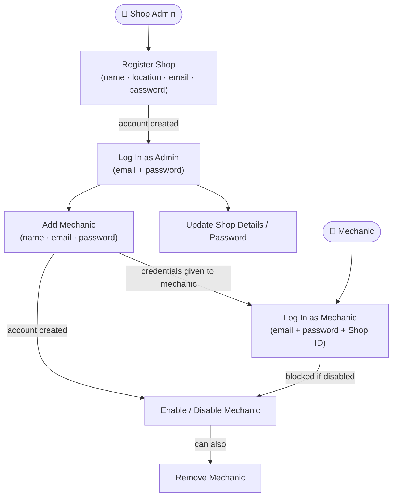
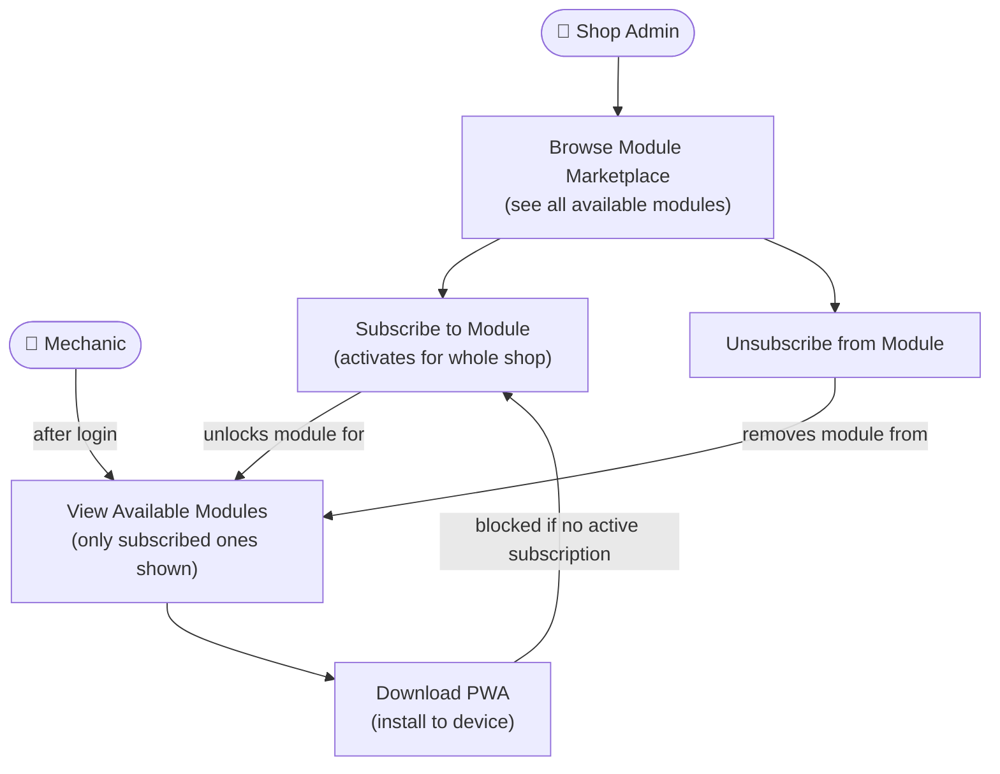
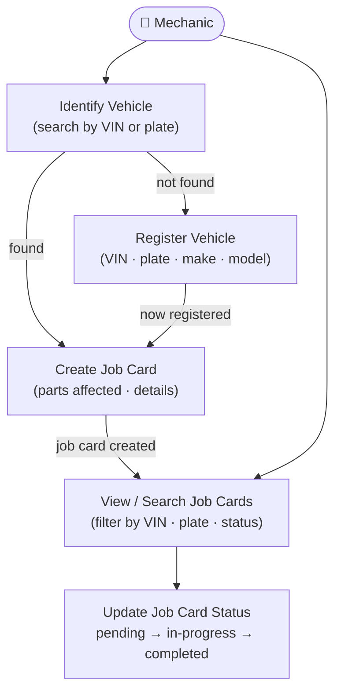
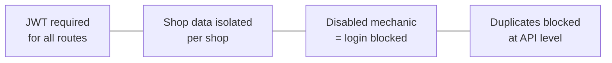
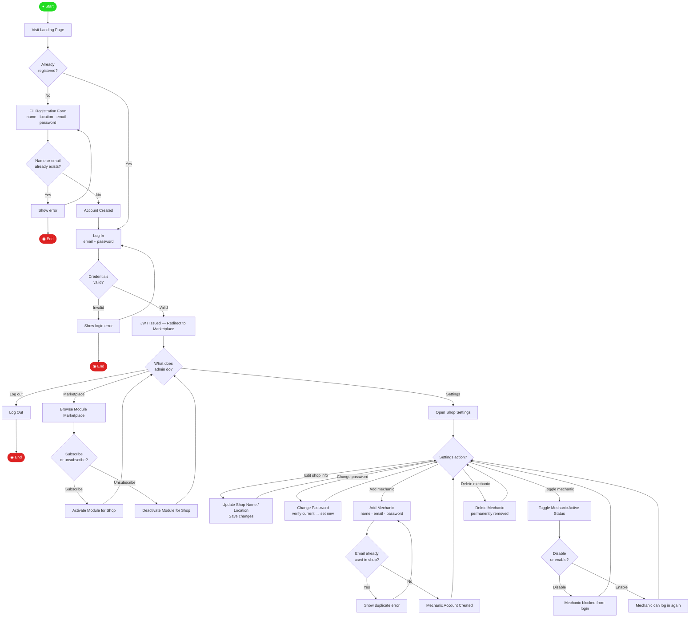
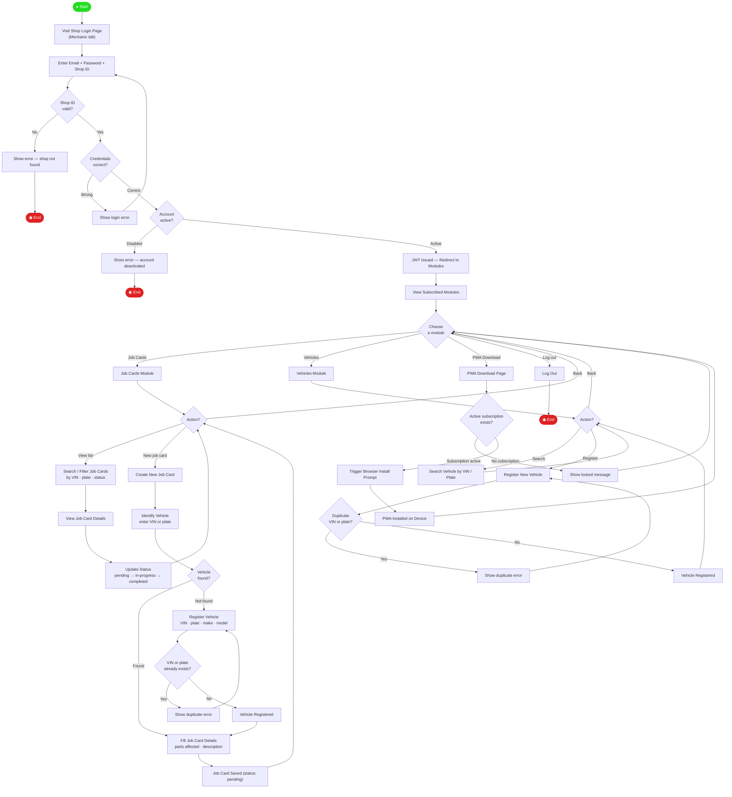

# Use Case Scenarios – CarrySpanner

---

## 1. Authentication & Account Management

> Registration, login, and all mechanic account actions flow into each other.

---

## 2. Module Marketplace & Access

> Subscribing to a module directly unlocks it for mechanics; the PWA gate depends on it.

---

## 3. Job Cards & Vehicle Management

> Identifying a vehicle feeds into creating a job card; missing vehicles trigger registration.

---

## 🔐 Shared Access Rules

---

## 🏪 Activity Diagram — Shop Admin

---

## 🔧 Activity Diagram — Mechanic

