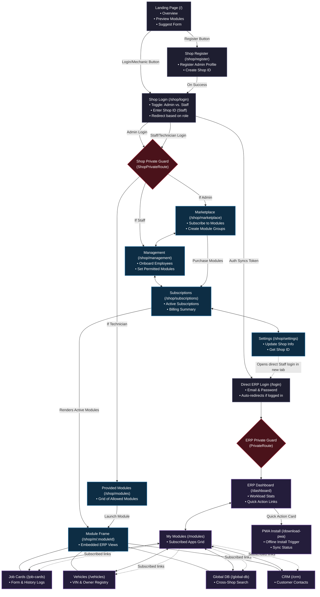

# 🔧 CarrySpanner Page Flow & Architecture Diagram

This document provides a comprehensive view of the page flow, user roles, routing guards, and layouts in the **CarrySpanner** workshop ERP application.

---

## 🏗️ System Overview

CarrySpanner uses two distinct portal flows with their own layout structures and state stores, but links them together seamlessly for end-user ergonomics:

1. **Shop Portal (`/shop/...`)**:
   - Layout: [ShopLayout](frontend/src/presentation/components/ShopLayout.tsx)
   - Store: `useShopAuthStore` (`localStorage` key: `shop-auth`)
   - Intended for: **Shop Admins**, **Office Staff**, and **Technicians** to perform administrative tasks, subscription management, employee onboarding, and module launch.
2. **Direct ERP Portal (`/...`)**:
   - Layout: [AppLayout](frontend/src/presentation/components/AppLayout.tsx)
   - Store: `useAuthStore` (`localStorage` key: `mow-auth`)
   - Intended for: **Workshop Floor Staff (Mechanics)** who want a dedicated, streamlined environment to log jobs and view vehicle histories.

---

## 👥 Access Roles & Portal Routing

The system handles three core roles at login:

| Role | Staff Role | Accessible Portals & Landing Redirections | Purpose / Layout |
| :--- | :--- | :--- | :--- |
| **Shop Admin** | *None* | Redirects to `/shop/marketplace` | Manage shop subscriptions, profile, billing, and employees via `/shop` (`ShopLayout`). |
| **Shop Staff** | `staff` | Redirects to `/shop/management` | View employee lists, register subscriptions, and access subscribed modules via `/shop` (`ShopLayout`). |
| **Technician** | `technician` | Redirects to `/shop/modules` *(Direct ERP: `/dashboard`)* | Execute repair work. Can use the simplified modules grid under `/shop/modules` or log into `/login` to access the full-screen ERP layout. |

### 🔄 Session Syncing (Ergonomic Logic)
To save technicians from logging in twice, when a user logs into `/shop/login` with the **Shop Staff/Technician** role:
1. They authenticate with the shop portal.
2. The login mutation automatically copies and syncs their credentials to the direct ERP portal store (`useAuthStore`).
3. Both API clients ([client.ts](frontend/src/infrastructure/api/client.ts) and [shopClient.ts](frontend/src/infrastructure/api/shopClient.ts)) share tokens, allowing seamless transitions between `/shop/m/...` and `/...` routes without re-authentication.

---

## 🗺️ Page Flow Diagram

---

## 🛠️ Page Flow Design Details & Integrations

### 1. Embedded Module Views
Rather than copying codebase features, CarrySpanner implements a **Wrapper Pattern** in [ShopModuleWrapper.tsx](frontend/src/presentation/pages/shop/ShopModuleWrapper.tsx).
- When a user views `/shop/m/job-cards`, the layout remains the `ShopLayout` frame, but the router renders the exact same `<JobCardsPage />` component used in the direct ERP `/job-cards` route.
- This creates unified views and ensures any enhancements to Job Cards, Vehicles, CRM, or the Global DB automatically apply to both the Shop Portal and direct ERP contexts.

### 2. Guard Redirection Logic
- **`ShopPrivateRoute`**: Validates the `shop-auth` session. Redirects to `/shop/login` if the user is unauthenticated or does not meet the role requirement (e.g., trying to access Marketplace without being an Admin).
- **`PrivateRoute`**: Validates the standard `mow-auth` session. Redirects to `/login` if unauthenticated.

### 3. Recent Improvements Applied
During structural review, the following improvements were implemented:
- **Registered the PWA Download page**: The offline install page ([PWADownloadPage.tsx](frontend/src/presentation/pages/erp/PWADownloadPage.tsx)) was created but omitted in router configuration. It is now registered at `/download-pwa` in [router.tsx](frontend/src/router.tsx).
- **Wired Dashboard "Download App" card**: The Action Card for App Installation on the ERP Dashboard was stubbed to show a "Coming Soon" modal. It now redirects users to the functional `/download-pwa` page.
- **Auto-Redirect at direct Login**: Added an authentication state observer to [LoginPage.tsx](frontend/src/presentation/pages/logins/LoginPage.tsx). Logged-in mechanics navigating directly to `/login` are automatically redirected to `/dashboard`, preventing duplicate sessions.

